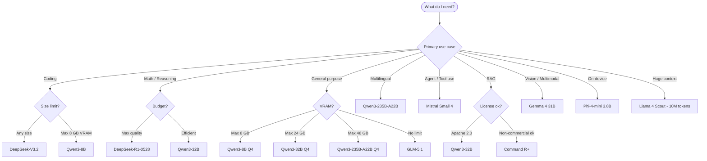

# Awesome Open-Weight Models 

> A practitioner-first guide to open-weight language models — verified licenses, real hardware requirements, deployment stacks, and per-task recommendations for engineers shipping products.

_Not a paper list. Not a hype list. Every entry answers: should I use this model, and how?_

---

## Why This List

Six major families now ship frontier-capable open-weight models under permissive licenses. The information landscape is noisy — wrong license information, stale model names, and fabricated benchmark numbers are everywhere. This list is sourced from primary sources: Hugging Face model cards, official blogs, and arXiv.

Benchmark numbers are deliberately omitted from model tables. Dynamic leaderboards go stale within weeks. Use the live sources in [Leaderboards](#leaderboards) instead.

---

## Quick Pick

> Skip the research. These are the right defaults for each use case.

| I need to...                          | Use this                | Active Params | License       |
| :------------------------------------ | :---------------------- | ------------: | :-----------: |
| Best open model, no constraints       | GLM-5.1                 |          40B  | MIT           |
| Best Apache 2.0 overall               | Qwen3-235B-A22B         |          22B  | Apache 2.0    |
| Best model under 40B                  | Qwen3-32B               |          32B  | Apache 2.0    |
| Best model under 8 GB VRAM            | Qwen3-8B                |           8B  | Apache 2.0    |
| Coding                                | DeepSeek-V3.2           |          37B  | MIT           |
| Hard reasoning and math               | DeepSeek-R1-0528        |          37B  | MIT           |
| Agent and function calling            | Mistral Small 4         |           6B  | Apache 2.0    |
| Huge context (up to 10M tokens)       | Llama 4 Scout           |          17B  | Community     |
| Multimodal vision and text            | Gemma 4 31B             |          31B  | Apache 2.0    |
| On-device and mobile                  | Phi-4-mini              |         3.8B  | MIT           |
| Fully permissive commercial MIT       | DeepSeek-R1-Distill-7B  |           7B  | MIT           |
| Enterprise RAG (non-commercial)       | Command R+              |         104B  | CC-BY-NC      |

---

## Decision Flowchart

---

## Model Families

### Qwen — Alibaba

`Apache 2.0` on all Qwen3 and Qwen3.6 models. Qwen2.5 has per-size license variations — read carefully before shipping.

#### Qwen3 — released April 29, 2025

<strong>Models</strong>

| Model           | Params                   | Context | License    |
| :-------------- | -----------------------: | ------: | :--------: |
| Qwen3-0.6B      | 0.6B dense               | 32K     | Apache 2.0 |
| Qwen3-1.7B      | 1.7B dense               | 32K     | Apache 2.0 |
| Qwen3-4B        | 4B dense                 | 32K     | Apache 2.0 |
| Qwen3-8B        | 8B dense                 | 128K    | Apache 2.0 |
| Qwen3-14B       | 14B dense                | 128K    | Apache 2.0 |
| Qwen3-32B       | 32B dense                | 128K    | Apache 2.0 |
| Qwen3-30B-A3B   | 30B total / 3B active    | 128K    | Apache 2.0 |
| Qwen3-235B-A22B | 235B total / 22B active  | 128K    | Apache 2.0 |

All sizes ship as base and instruct variants. Weights on Hugging Face, ModelScope, and Kaggle with no gating.

#### Qwen3.6 — released April 16, 2026

<strong>Models</strong>

| Model           | Params                  | Context           | License    |
| :-------------- | ----------------------: | ----------------: | :--------: |
| Qwen3.6-35B-A3B | 35B total / 3B active   | 256K (1M w/YaRN) | Apache 2.0 |

Multimodal: text, image, and video inputs. Qwen3.6-Plus is API-only with no public weights.

#### Qwen2.5 — released September 2024

<strong>Models and licenses</strong>

| Model        | Params  | Context | License                                      |
| :----------- | ------: | ------: | :------------------------------------------- |
| Qwen2.5-0.5B | 0.49B   | 32K     | Apache 2.0                                   |
| Qwen2.5-1.5B | 1.54B   | 32K     | Apache 2.0                                   |
| Qwen2.5-3B   | 3.09B   | 32K     | Qwen Research License (non-commercial only)  |
| Qwen2.5-7B   | 7.61B   | 128K    | Apache 2.0                                   |
| Qwen2.5-14B  | 14.7B   | 128K    | Apache 2.0                                   |
| Qwen2.5-32B  | 32.5B   | 128K    | Apache 2.0                                   |
| Qwen2.5-72B  | 72.7B   | 128K    | Qwen License (custom — commercial needs Alibaba approval >100M MAU) |

> **Qwen2.5-72B license warning**: Uses the Tongyi Qianwen License, not Apache 2.0. Commercial products with >100M MAU must apply separately to Alibaba Cloud. Prefer Qwen3 models for clean Apache 2.0 at any size.

**Resources** — [Hugging Face](https://huggingface.co/Qwen) · [Blog](https://qwenlm.github.io/)

---

### Gemma — Google DeepMind

> **Gemma 3 and Gemma 4 have different licenses.** Gemma 3 uses a custom Google "Gemma Terms of Use" (not Apache 2.0, not OSI-approved). Gemma 4 switched to Apache 2.0.

#### Gemma 4 — released April 2, 2026 — `Apache 2.0`

<strong>Models</strong>

| Model           | Params                        | Context | Notes                           |
| :-------------- | ----------------------------: | ------: | :------------------------------ |
| gemma-4-E2B     | 2.3B effective (5.1B total)   | 128K    | Multimodal: text, image, audio  |
| gemma-4-E4B     | 4.5B effective (8B total)     | 128K    | Multimodal: text, image, audio  |
| gemma-4-26B-A4B | 26B total / 4B active (MoE)   | 256K    | Near-30B quality at 8B speed    |
| gemma-4-31B     | 31B dense                     | 256K    | Multimodal flagship             |

All four sizes ship as base and instruction-tuned (-it) variants. No gating — freely downloadable.

#### Gemma 3 — released March 12, 2025 — `Gemma Terms of Use`

<strong>Models</strong>

| Model       | Params | Context | License            |
| :---------- | -----: | ------: | :----------------- |
| gemma-3-1b  | 1B     | 32K     | Gemma Terms of Use |
| gemma-3-4b  | 4B     | 128K    | Gemma Terms of Use |
| gemma-3-12b | 12B    | 128K    | Gemma Terms of Use |
| gemma-3-27b | 27B    | 128K    | Gemma Terms of Use |

> Commercial use is allowed under the Gemma Terms of Use but Google reserves the right to restrict usage remotely. This is not an OSI-approved open-source license.

**Resources** — [Hugging Face](https://huggingface.co/google) · [Gemma Terms of Use](https://ai.google.dev/gemma/terms) · [Gemma 4 announcement](https://huggingface.co/blog/gemma4)

---

### Llama — Meta

`Llama 4 Community License` — commercial use allowed; >700M MAU requires a separate Meta license. Weights are gated (free, requires Hugging Face account and license acceptance).

#### Llama 4 — released April 5, 2025

<strong>Models</strong>

| Model                              | Active / Total     | Experts | Context    |
| :--------------------------------- | -----------------: | ------: | ---------: |
| Llama-4-Scout-17B-16E-Instruct     | 17B / ~109B        | 16      | 10M tokens |
| Llama-4-Scout-17B-16E              | 17B / ~109B        | 16      | 10M tokens |
| Llama-4-Maverick-17B-128E-Instruct | 17B / ~400B        | 128     | 1M tokens  |
| Llama-4-Maverick-17B-128E          | 17B / ~400B        | 128     | 1M tokens  |

Pre-training context: 256K for both. Maverick ships in BF16 and FP8. Scout ships in BF16 with on-the-fly int4 support.

**Resources** — [Hugging Face](https://huggingface.co/meta-llama) · [Release blog](https://huggingface.co/blog/llama4-release)

---

### DeepSeek

`MIT` on all open-weight releases — no usage restrictions, no gating. Weights freely downloadable without login.

<strong>Models</strong>

| Model                    | Active / Total      | Context | Specialty                         |
| :----------------------- | ------------------: | ------: | :-------------------------------- |
| DeepSeek-V3.2            | 37B / ~685B (MoE)   | 128K    | General, coding (newest)          |
| DeepSeek-V3              | 37B / 671B (MoE)    | 128K    | General, coding                   |
| DeepSeek-R1-0528         | 37B / 671B (MoE)    | 128K    | Reasoning (updated, stronger)     |
| DeepSeek-R1              | 37B / 671B (MoE)    | 128K    | Reasoning (original)              |
| DeepSeek-R1-Distill-70B  | 70B dense           | 128K    | Llama Community License base      |
| DeepSeek-R1-Distill-32B  | 32B dense           | 128K    | Apache 2.0 (Qwen base)            |
| DeepSeek-R1-Distill-14B  | 14B dense           | 128K    | Apache 2.0 (Qwen base)            |
| DeepSeek-R1-Distill-8B   | 8B dense            | 128K    | Apache 2.0 (Qwen base)            |
| DeepSeek-R1-Distill-7B   | 7B dense            | 128K    | Apache 2.0 (Qwen base)            |
| DeepSeek-R1-Distill-1.5B | 1.5B dense          | 128K    | Apache 2.0 (Qwen base)            |

> **Distilled model licenses**: Distills based on Qwen inherit Apache 2.0. Distills based on Llama 3 inherit the Llama Community License. Base DeepSeek models (V3, R1, V3.2) are MIT.

**Resources** — [Hugging Face](https://huggingface.co/deepseek-ai) · [GitHub](https://github.com/deepseek-ai) · [R1 paper](https://arxiv.org/abs/2501.12948) · [V3 paper](https://arxiv.org/abs/2412.19437)

---

### Mistral

`Apache 2.0` across all current releases. No gating.

<strong>Models</strong>

| Model                       | Active / Total     | Context | Notes                          |
| :-------------------------- | -----------------: | ------: | :----------------------------- |
| Mistral-Small-4-119B-2603   | 6B / 119B (MoE)    | 256K    | Tool use, reasoning, vision    |
| Mistral-Large-3-675B-2512   | 41B / 675B (MoE)   | 256K    | Frontier, multimodal           |
| Mistral-Small-3.1-24B-2503  | 24B dense          | 128K    | Multimodal, efficient          |
| Ministral-14B               | 14B dense          | 256K    | Multimodal                     |
| Ministral-8B                | 8B dense           | 256K    | Multimodal                     |
| Ministral-3B                | 3B dense           | 256K    | Multimodal, edge               |

> **Mistral Small 4** (119B MoE / 6B active): optimized for function calling and agentic workflows. Despite 119B total parameters, it runs at the speed and cost of a ~6B dense model.

**Resources** — [Hugging Face](https://huggingface.co/mistralai) · [Docs](https://docs.mistral.ai/)

---

### Phi — Microsoft

`MIT` across all variants. No gating.

<strong>Models</strong>

| Model                     | Params | Context | Notes                            |
| :------------------------ | -----: | ------: | :------------------------------- |
| Phi-4-reasoning-vision-15B | 15B   | 16K     | Vision and reasoning (Mar 2026)  |
| Phi-4-reasoning-plus      | 14B    | 32K     | Extended reasoning               |
| Phi-4-reasoning           | 14B    | 32K     | Reasoning-optimized              |
| Phi-4                     | 14B    | 16K     | Base language model              |
| Phi-4-multimodal-instruct | 5.6B   | 128K    | Vision and audio                 |
| Phi-4-mini-reasoning      | 3.8B   | 128K    | Compact reasoning                |
| Phi-4-mini                | 3.8B   | 200K    | Best-in-class at 4B scale        |

**Resources** — [Hugging Face](https://huggingface.co/microsoft) · [Phi-4 paper](https://arxiv.org/abs/2412.08905) · [Phi-4-reasoning report](https://www.microsoft.com/en-us/research/publication/phi-4-reasoning-technical-report/)

---

### GLM — Zhipu AI

`MIT` across all variants. Highest-ranked open-weight model on Chatbot Arena as of April 2026.

<strong>Models</strong>

| Model       | Active / Total         | Context | Notes                             |
| :---------- | ---------------------: | ------: | :-------------------------------- |
| GLM-5.1     | ~40B / 754B (MoE)      | ~200K   | Rank 16 on Chatbot Arena, Elo 1469 |
| GLM-5       | 40B / 744B (MoE)       | 200K    | Trained on Huawei Ascend chips    |
| GLM-4.5     | 32B / 355B (MoE)       | 128K    |                                   |
| GLM-4.5-Air | 12B / 106B (MoE)       | 128K    | Lightweight variant               |

> GLM-5.1 is the highest-ranked open-weight model on [Chatbot Arena](https://arena.ai/leaderboard/text) as of April 2026 (Elo 1469, rank 16 overall). Source: live leaderboard, fetched April 2026.

**Resources** — [Hugging Face](https://huggingface.co/zai-org)

---

### Command R — Cohere Labs

`CC-BY-NC-4.0` — non-commercial only. The newest Cohere API model (Command A, March 2025) has no public weights.

<strong>Models</strong>

| Model                    | Params | Context | Notes                               |
| :----------------------- | -----: | ------: | :---------------------------------- |
| c4ai-command-r-plus      | 104B   | 128K    | RAG-optimized, citation generation  |
| c4ai-command-r7b-12-2024 | 7B     | 128K    | Lightweight RAG                     |

> **Commercial use requires a paid Cohere license.** The CC-BY-NC weights are research releases only. For commercial RAG use Apache 2.0 alternatives like Qwen3-32B or Mistral Small 3.1.

**Resources** — [Hugging Face](https://huggingface.co/CohereLabs)

---

## Licensing Guide

| Model Family                          | License              | Commercial | Derivatives | User Cap                              |
| :------------------------------------ | :------------------: | :--------: | :---------: | :------------------------------------ |
| Qwen3 (all sizes)                     | Apache 2.0           | Yes        | Yes         | None                                  |
| Qwen3.6-35B-A3B                       | Apache 2.0           | Yes        | Yes         | None                                  |
| Qwen2.5 (0.5B, 1.5B, 7B–32B)         | Apache 2.0           | Yes        | Yes         | None                                  |
| Qwen2.5-3B                            | Qwen Research        | No         | No          | Non-commercial only                   |
| Qwen2.5-72B                           | Qwen License         | Limited    | Limited     | >100M MAU needs Alibaba approval      |
| Gemma 4 (all sizes)                   | Apache 2.0           | Yes        | Yes         | None                                  |
| Gemma 3 (all sizes)                   | Gemma Terms of Use   | Limited    | Limited     | Google can restrict remotely          |
| Llama 4 (Scout, Maverick)             | Llama 4 Community    | Limited    | Limited     | >700M MAU needs Meta approval         |
| DeepSeek (R1, R1-0528, V3, V3.2)     | MIT                  | Yes        | Yes         | None                                  |
| DeepSeek R1 distills (Qwen base)      | Apache 2.0           | Yes        | Yes         | None                                  |
| DeepSeek R1 distills (Llama base)     | Llama 4 Community    | Limited    | Limited     | >700M MAU cap                         |
| Mistral (all current models)          | Apache 2.0           | Yes        | Yes         | None                                  |
| Phi-4 (all variants)                  | MIT                  | Yes        | Yes         | None                                  |
| GLM-4.5, GLM-5, GLM-5.1              | MIT                  | Yes        | Yes         | None                                  |
| Command R+                            | CC-BY-NC-4.0         | No         | Limited     | Commercial license required           |

> **Safest default**: MIT (DeepSeek, Phi-4, GLM) or Apache 2.0 (Qwen3, Gemma 4, Mistral). No user-count caps, no approval requirements.

---

## Hardware Requirements

### Minimum GPU VRAM (full BF16 precision)

| Model                 | Params            | VRAM Required | Comfortable Setup       |
| :-------------------- | ----------------: | ------------: | :---------------------- |
| Phi-4-mini            | 3.8B              | 8 GB          | Any RTX 30-series       |
| Qwen3-8B              | 8B                | 16 GB         | RTX 3080, M3 Pro        |
| Ministral-8B          | 8B                | 16 GB         | RTX 3080, M3 Pro        |
| Phi-4                 | 14B               | 28 GB         | RTX 3090, M3 Max 36GB   |
| Qwen3-14B             | 14B               | 28 GB         | RTX 3090, M3 Max        |
| Mistral Small 3.1     | 24B               | 55 GB         | 2x RTX 3090             |
| Qwen3-32B             | 32B               | 64 GB         | 2x A100 40GB            |
| Gemma 4 31B           | 31B               | 64 GB         | 2x RTX 4090             |
| Llama 4 Scout         | 109B MoE          | ~220 GB       | 8x A100 40GB            |
| Qwen3-235B-A22B       | 235B MoE          | ~450 GB       | 8x A100 80GB            |
| DeepSeek-R1 / V3.2    | ~685B MoE         | ~1.4 TB       | 8x H100 80GB            |
| GLM-5.1               | ~754B MoE         | ~1.4 TB       | 8x H100 80GB            |

### With Q4\_K\_M Quantization

| Model             | BF16 VRAM | Q4\_K\_M VRAM | Quality Impact |
| :---------------- | --------: | ------------: | :------------- |
| Qwen3-8B          | 16 GB     | ~5 GB         | Minimal        |
| Phi-4             | 28 GB     | ~9 GB         | Minimal        |
| Qwen3-32B         | 64 GB     | ~20 GB        | Low            |
| Gemma 4 31B       | 64 GB     | ~20 GB        | Low            |
| Mistral Small 3.1 | 55 GB     | ~15 GB        | Low            |
| Qwen3-235B-A22B   | ~450 GB   | ~140 GB       | Moderate       |

> MoE models are efficient: Gemma 4 26B-A4B runs at 8B-class speed (only 4B active per forward pass) while delivering near-30B quality.

### Apple Silicon (Unified Memory)

| Chip          | RAM    | Recommended Models                      | Speed (est.)  |
| :------------ | -----: | :-------------------------------------- | :------------ |
| M4 / M3 base  | 16 GB  | Qwen3-8B Q4, Phi-4-mini                 | 30–50 tok/s   |
| M3 Pro        | 36 GB  | Qwen3-14B Q4, Ministral-8B              | 20–35 tok/s   |
| M3 Max        | 48 GB  | Qwen3-32B Q4, Gemma 4 31B Q4           | 15–25 tok/s   |
| M3 Ultra      | 192 GB | Qwen3-235B-A22B Q4                     | 10–18 tok/s   |
| M4 Max        | 128 GB | Qwen3-235B-A22B Q4                     | ~5.5 tok/s    |

> MLX achieves 20–50% faster inference than llama.cpp on Apple Silicon. Q4\_K\_M preserves ~95–98% of full-precision quality.

---

## Per-Task Recommendations

### Coding

| Use Case              | Best                | Runner-Up           | Notes                                 |
| :-------------------- | :------------------ | :------------------ | :------------------------------------ |
| Code generation       | DeepSeek-V3.2       | Qwen3-32B           | DeepSeek trained specifically on code |
| Hard agentic tasks    | DeepSeek-R1-0528    | Qwen3-235B-A22B     | Reasoning and code combined           |
| On-device code        | Qwen3-8B            | Phi-4-mini          | Best at size bracket                  |
| Code completion (FIM) | Mistral Small 3.1   | Qwen3-8B            | Mistral has strong FIM support        |

### Reasoning and Math

| Use Case            | Best                  | Runner-Up           | Notes                                    |
| :------------------ | :-------------------- | :------------------ | :--------------------------------------- |
| Hard math           | DeepSeek-R1-0528      | DeepSeek-R1         | R1-0528 substantially improves on R1     |
| Compact reasoning   | Qwen3-32B             | Phi-4-reasoning     | Both have extended thinking modes        |
| On-device reasoning | Phi-4-mini-reasoning  | DeepSeek-R1-Distill-7B | MIT, fits 8 GB VRAM Q4               |

### Multilingual

| Language Pair        | Best                | Runner-Up       | Notes                               |
| :------------------- | :------------------ | :-------------- | :---------------------------------- |
| Chinese-English      | Qwen3-235B-A22B     | GLM-5.1         | Qwen trained heavily on Chinese     |
| European languages   | Mistral Small 3.1   | Qwen3-32B       | Mistral strong on EU languages      |
| General multilingual | Qwen3-235B-A22B     | Qwen3-32B       | Best open multilingual coverage     |

### Vision and Multimodal

| Use Case             | Best                    | Runner-Up              | Notes                                |
| :------------------- | :---------------------- | :--------------------- | :----------------------------------- |
| Vision and text      | Gemma 4 31B             | Mistral Small 4        | Gemma 4 is Apache 2.0 multimodal     |
| Vision and reasoning | Phi-4-reasoning-vision  | Gemma 4 31B            | Phi-4 specialized for reasoning      |
| Vision and audio     | Gemma 4 E2B / E4B       | Phi-4-multimodal       | Both support audio input             |
| Efficient multimodal | Gemma 4 26B-A4B         | Gemma 4 E4B            | MoE: near-30B quality at 8B speed    |

### RAG and Long Context

| Use Case                    | Best                | Runner-Up           | Notes                                      |
| :-------------------------- | :------------------ | :------------------ | :----------------------------------------- |
| Long context up to 10M tok  | Llama 4 Scout       | —                   | Only model with verified 10M context       |
| Long context up to 1M tok   | Llama 4 Maverick    | Qwen3-235B-A22B     | Maverick supports 1M context               |
| Citation RAG                | Command R+          | —                   | Built-in citation generation; CC-BY-NC     |
| Commercial RAG              | Qwen3-32B           | Mistral Small 3.1   | Apache 2.0, strong retrieval               |

### Agentic and Tool Use

| Use Case          | Best                | Runner-Up           | Notes                                  |
| :---------------- | :------------------ | :------------------ | :------------------------------------- |
| Function calling  | Mistral Small 4     | Qwen3-32B           | Mistral Small 4 built for tool use     |
| Multi-step agent  | GLM-5.1             | DeepSeek-V3.2       | Top open model on Chatbot Arena        |
| Lightweight agent | Qwen3-8B            | Ministral-8B        | Tool calling at 8B scale               |

---

## Deployment Stacks

### Local Inference

| Tool                                                    | Best For                  | Platform | Notes                               |
| :------------------------------------------------------ | :------------------------ | :------: | :---------------------------------- |
| [Ollama](https://github.com/ollama/ollama)              | Dev and personal use      | All      | Easiest setup; one-command model pull |
| [LM Studio](https://lmstudio.ai/)                       | GUI exploration           | Mac, Win | Best UX for non-technical users     |
| [llama.cpp](https://github.com/ggml-org/llama.cpp)      | Performance and control   | All      | Gold standard CPU/GPU inference     |
| [MLX](https://github.com/ml-explore/mlx)               | Apple Silicon             | Mac only | 20–50% faster than llama.cpp on Mac |
| [Jan](https://github.com/janhq/jan)                     | Privacy-first desktop app | All      | Open-source LM Studio alternative   |

### Production Inference Servers

| Tool                                                                        | Throughput | GPU         | Best For                            |
| :-------------------------------------------------------------------------- | :--------: | :---------: | :---------------------------------- |
| [vLLM](https://github.com/vllm-project/vllm)                                | Highest    | NVIDIA, AMD | High-traffic APIs, PagedAttention   |
| [SGLang](https://github.com/sgl-project/sglang)                             | Highest    | NVIDIA      | Structured output, complex schemas  |
| [TGI](https://github.com/huggingface/text-generation-inference)              | High       | NVIDIA, AMD | Hugging Face ecosystem              |
| [ExLlamaV2](https://github.com/turboderp/exllamav2)                         | High       | NVIDIA      | GPTQ/EXL2 quantized inference       |
| [MLC-LLM](https://github.com/mlc-ai/mlc-llm)                               | Medium     | Universal   | iOS, Android, web, desktop          |
| [llama.cpp server](https://github.com/ggml-org/llama.cpp)                   | Medium     | Any         | Edge, low VRAM, CPU fallback        |

### Managed Cloud APIs

| Provider                                | Notable Open Models       | Notes                                  |
| :-------------------------------------- | :------------------------ | :------------------------------------- |
| [Together AI](https://www.together.ai/) | 50+ open models           | Widest open-model catalog              |
| [Fireworks AI](https://fireworks.ai/)   | Llama, Qwen, DeepSeek     | Speed-optimized serving                |
| [Groq](https://groq.com/)               | Llama, Mistral, Gemma     | Fastest inference (LPU hardware)       |
| [Cerebras](https://www.cerebras.net/)   | Llama family              | Extreme speed on CS-3 wafer chip       |
| [Hyperbolic](https://hyperbolic.xyz/)   | Llama, Qwen, DeepSeek     | Competitive pricing                    |
| [Replicate](https://replicate.com/)     | Most open models          | Serverless, easy API                   |
| [Modal](https://modal.com/)             | Any model via custom deploy | Infrastructure-as-code, any model    |
| [Vast.ai](https://vast.ai/)             | Self-managed              | Cheapest H100 GPU access               |
| [RunPod](https://runpod.io/)            | Self-managed              | Pod and serverless options             |

---

## Quantization Guide

### Format Comparison

| Format        | Tool      | VRAM Saved | Quality   | Speed    | Best For                    |
| :------------ | :-------- | ---------: | :-------- | :------- | :-------------------------- |
| GGUF Q2\_K    | llama.cpp | ~75%       | Poor      | Fast     | Extreme RAM constraint only |
| GGUF Q4\_K\_M | llama.cpp | ~55%       | Good      | Fast     | Recommended default         |
| GGUF Q5\_K\_M | llama.cpp | ~45%       | Good      | Moderate | Quality-critical tasks      |
| GGUF Q8\_0    | llama.cpp | ~20%       | Excellent | Moderate | Near-lossless               |
| AWQ 4-bit     | AutoAWQ   | ~55%       | Good      | Fastest  | NVIDIA, max throughput      |
| GPTQ 4-bit    | AutoGPTQ  | ~55%       | Good      | Fast     | NVIDIA production           |
| EXL2          | ExLlamaV2 | Variable   | Good      | Fast     | NVIDIA, custom bit-rates    |

### Where to Get Pre-Quantized Models

| Curator                                             | Formats    | Notes                                          |
| :-------------------------------------------------- | :--------: | :--------------------------------------------- |
| [bartowski](https://huggingface.co/bartowski)       | GGUF       | Best quality GGUF, all major models            |
| [mradermacher](https://huggingface.co/mradermacher)  | GGUF       | Fast releases on new models                   |
| [LoneStriker](https://huggingface.co/LoneStriker)    | GGUF, EXL2 | Good EXL2 selection                           |
| [TheBloke](https://huggingface.co/TheBloke)          | GGUF, GPTQ | Large catalog; less active since 2025         |

---

## Fine-Tuning

### Frameworks

| Tool                                                          | Stars | Methods               | Notes                                          |
| :------------------------------------------------------------ | ----: | :-------------------- | :--------------------------------------------- |
| [LLaMA-Factory](https://github.com/hiyouga/LLaMA-Factory)    | 38k+  | LoRA, Full, RLHF, DPO | Best WebUI; supports 100+ models               |
| [Unsloth](https://github.com/unslothai/unsloth)               | 28k+  | LoRA, QLoRA           | 2x faster, 60% less VRAM — recommended default |
| [TRL](https://github.com/huggingface/trl)                     | 10k+  | RLHF, DPO, GRPO, PPO  | Hugging Face reference for alignment           |
| [Axolotl](https://github.com/axolotl-ai-cloud/axolotl)        | 8k+   | LoRA, Full            | Config-file driven; production battle-tested   |
| [torchtune](https://github.com/pytorch/torchtune)             | 5k+   | Full, LoRA            | Native PyTorch; easiest to customize           |
| [ms-swift](https://github.com/modelscope/ms-swift)            | 6k+   | LoRA, Full            | Best Qwen support; ModelScope ecosystem        |

### Key Techniques

| Technique    | VRAM   | Use Case               | Notes                                      |
| :----------- | :----- | :--------------------- | :----------------------------------------- |
| QLoRA        | Low    | Consumer GPU fine-tune | 4-bit base + LoRA adapters                 |
| LoRA         | Medium | Efficient fine-tuning  | Rank 16–64; best quality/cost tradeoff     |
| DPO          | Medium | Alignment, preference  | Replaces RLHF for most cases               |
| GRPO         | Medium | Reasoning alignment    | Used in DeepSeek-R1 training recipe        |
| Full SFT     | High   | Maximum quality        | Multi-GPU required for 7B+                 |
| Distillation | Medium | Compress large to small | Teach 7B from 70B+ teacher outputs        |

### Datasets

| Dataset                                                                                  | Examples | Use Case              | License    |
| :--------------------------------------------------------------------------------------- | -------: | :-------------------- | :--------: |
| [Open-Hermes-2.5](https://huggingface.co/datasets/teknium/OpenHermes-2.5)               | 1M       | General instruction   | Apache 2.0 |
| [Magpie-Pro](https://huggingface.co/datasets/Magpie-Align/Magpie-Pro-1M-v0.1)          | 1M       | High-quality instruct | Apache 2.0 |
| [SlimOrca](https://huggingface.co/datasets/Open-Orca/SlimOrca)                          | 500K     | Instruction following | MIT        |
| [UltraFeedback](https://huggingface.co/datasets/openbmb/UltraFeedback)                  | 250K     | DPO and preference    | Apache 2.0 |
| [MetaMathQA](https://huggingface.co/datasets/meta-math/MetaMathQA)                      | 395K     | Math reasoning        | MIT        |
| [CodeFeedback](https://huggingface.co/datasets/m-a-p/CodeFeedback-Filtered-Instruction) | 156K     | Code instruction      | Apache 2.0 |

---

## Evaluation Tools

| Tool                                                                          | Measures                  | Notes                                          |
| :---------------------------------------------------------------------------- | :------------------------ | :--------------------------------------------- |
| [lm-evaluation-harness](https://github.com/EleutherAI/lm-evaluation-harness) | Comprehensive benchmarks  | EleutherAI standard; powers Open LLM Leaderboard |
| [LiveCodeBench](https://github.com/LiveCodeBench/LiveCodeBench)               | Coding, contamination-free | Fresh problems; harder to game               |
| [HELMET](https://github.com/princeton-nlp/HELMET)                             | Long-context tasks        | Best for validating context window claims      |
| [Braintrust](https://www.braintrust.dev/)                                     | Custom domain eval        | Best for eval on your own production data      |
| [Langfuse](https://github.com/langfuse/langfuse)                              | Tracing and eval in prod  | Open-source, self-hostable                     |
| [RAGAS](https://github.com/explodinggradients/ragas)                          | RAG pipelines             | Standard for retrieval-augmented evaluation    |
| [DeepEval](https://github.com/confident-ai/deepeval)                          | Unit-test-style eval      | Developer-friendly, CI-integratable            |
| [PromptFoo](https://github.com/promptfoo/promptfoo)                           | Red teaming and adversarial | Best for safety and robustness testing       |

---

## Community and Leaderboards

### Leaderboards

| Leaderboard                                                                                      | Focus                       | Notes                                          |
| :----------------------------------------------------------------------------------------------- | :-------------------------- | :--------------------------------------------- |
| [Chatbot Arena](https://arena.ai/leaderboard/text)                                               | Human preference, blind A/B | Best proxy for real-world quality; live Elo    |
| [Open LLM Leaderboard](https://huggingface.co/spaces/open-llm-leaderboard/open_llm_leaderboard) | Standardized benchmarks     | Hugging Face canonical; IFEval, GPQA, MMLU-Pro |
| [SWE-bench](https://www.swebench.com/)                                                           | Real GitHub issue resolution | Hardest coding benchmark; most realistic      |
| [BigCodeBench](https://bigcode-bench.github.io/)                                                 | Code generation             | Dedicated coding leaderboard                   |
| [SEAL Leaderboard](https://scale.com/leaderboard)                                                | Expert evaluation           | Strong contamination controls                  |

### Communities

| Community                                              | Platform | Focus                                      |
| :----------------------------------------------------- | :------: | :----------------------------------------- |
| [r/LocalLLaMA](https://www.reddit.com/r/LocalLLaMA/)   | Reddit   | Self-hosting, benchmarks, model releases   |
| [r/MachineLearning](https://www.reddit.com/r/MachineLearning/) | Reddit | Research, new models, papers         |
| [Hugging Face Discord](https://discord.gg/huggingface) | Discord  | Model releases, fine-tuning help           |
| [EleutherAI Discord](https://discord.gg/eleutherai)    | Discord  | Open-source training and evaluation        |

### Stay Updated

- [Hugging Face Daily Papers](https://huggingface.co/papers) — research papers same day as arXiv
- [Latent Space Podcast](https://www.latent.space/) — deep technical breakdowns of new models
- [Simon Willison's blog](https://simonwillison.net/) — practitioner notes on every major release

---

## Contributing

PRs welcome for:

- New model releases with license and parameter count verified from the official Hugging Face model card
- Hardware requirement corrections
- Deployment stack updates
- Per-task recommendation changes backed by leaderboard evidence

**PR requirements:**

1. Model entries must link to the official Hugging Face model card
2. License must match the exact text in the model card, not a README summary
3. Benchmark claims must cite a primary source (leaderboard URL or arXiv)
4. No pre-release models — weights must be publicly downloadable
5. No vendor-sponsored entries without explicit disclosure

See [CONTRIBUTING.md](CONTRIBUTING.md) for full guidelines.

---

## Star History

---

CC0 — No rights reserved.

