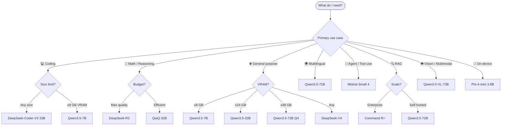

<h1>Awesome Open-Weight Models</h1>

<strong>The practitioner's guide to open-weight LLMs — benchmarks, licensing, hardware, deployment, and fine-tuning.</strong> 
Curated for engineers shipping real products in 2026.

 

**Not a paper list. Not a hype list. A decision-making tool.**

*Every entry answers: should I use this model, and how?*

 

[Quick Pick](#-quick-pick) &nbsp;·&nbsp;
[Model Families](#-model-families) &nbsp;·&nbsp;
[Benchmarks](#-benchmark-tables) &nbsp;·&nbsp;
[Licensing](#-licensing-guide) &nbsp;·&nbsp;
[Hardware](#-hardware-requirements) &nbsp;·&nbsp;
[Deployment](#-deployment-stacks) &nbsp;·&nbsp;
[Fine-tuning](#-fine-tuning) &nbsp;·&nbsp;
[Evaluation](#-evaluation-tools)

---

## Why This List

April 2026 is the most competitive moment in open-source AI history. Six major labs shipped Apache 2.0 frontier models in a single quarter:

| Model | Lab | License | Context | Released |
| :--- | :--- | :---: | ---: | :---: |
| **Qwen 3.5** | Alibaba | `Apache 2.0` | 128K | Mar 2026 |
| **Gemma 4** | Google DeepMind | `Apache 2.0` | 128K | Apr 2026 |
| **Llama 4** | Meta | `Community` | 10M | Mar 2026 |
| **DeepSeek V4** | DeepSeek | `MIT` | 128K | Feb 2026 |
| **Mistral Small 4** | Mistral AI | `Apache 2.0` | 128K | Mar 2026 |
| **GLM-5.1** | Zhipu AI | `Apache 2.0` | 128K | Apr 2026 |

Developers face an information overload crisis with no single authoritative reference. This is it.

---

## ⚡ Quick Pick

> Skip the research. These are the right defaults for each use case.

| I need to… | Use this | Size | VRAM |
| :--- | :--- | :---: | ---: |
| **Code generation** | DeepSeek-Coder-V3 | 33B | 22 GB Q4 |
| **Hard reasoning / math** | QwQ-32B | 32B | 20 GB Q4 |
| **Best general model (no limits)** | Qwen3.5-72B | 72B | 45 GB Q4 |
| **Best general model (≤24 GB VRAM)** | Qwen3.5-32B | 32B | 20 GB Q4 |
| **Best general model (≤8 GB VRAM)** | Qwen3.5-7B | 7B | 5 GB Q4 |
| **Agent / function calling** | Mistral Small 4 | 22B | 14 GB Q4 |
| **Multilingual** | Qwen3.5-72B | 72B | 45 GB Q4 |
| **Vision / document OCR** | Qwen3.5-VL-72B | 72B | 45 GB Q4 |
| **RAG with citations** | Command R+ | 104B | — (hosted) |
| **Huge context (1M–10M tokens)** | Llama 4 Scout 17B | 17B MoE | 38 GB |
| **On-device / mobile** | Phi-4-mini | 3.8B | 3 GB Q4 |
| **Fully open commercial (MIT)** | DeepSeek V4 | 685B MoE | API/hosted |

---

## 🗺️ Decision Flowchart

---

## 📋 Contents

- [Why This List](#why-this-list)
- [Quick Pick](#-quick-pick)
- [Decision Flowchart](#️-decision-flowchart)
- [Model Families](#-model-families)
  - [Qwen — Alibaba](#qwen--alibaba)
  - [Gemma — Google](#gemma--google)
  - [Llama — Meta](#llama--meta)
  - [DeepSeek](#deepseek)
  - [Mistral](#mistral)
  - [GLM — Zhipu AI](#glm--zhipu-ai)
  - [Phi — Microsoft](#phi--microsoft)
  - [Command R — Cohere](#command-r--cohere)
- [Benchmark Tables](#-benchmark-tables)
- [Licensing Guide](#-licensing-guide)
- [Hardware Requirements](#-hardware-requirements)
- [Per-Task Recommendations](#-per-task-recommendations)
- [Deployment Stacks](#-deployment-stacks)
- [Quantization Guide](#-quantization-guide)
- [Fine-Tuning](#-fine-tuning)
- [Evaluation Tools](#-evaluation-tools)
- [Community & Leaderboards](#-community--leaderboards)
- [Contributing](#contributing)

---

## 🤖 Model Families

### Qwen — Alibaba

`Apache 2.0` &nbsp; Most commercially deployed open-weight family globally. Best multilingual coverage. Widest size range (0.5B → 72B).

<strong>Language Models</strong>

| Model | Params | Context | Strengths | Best For |
| :--- | ---: | ---: | :--- | :--- |
| Qwen3.5-0.5B | 0.5B | 32K | Ultra-tiny, embedding | IoT, edge, classification |
| Qwen3.5-1.8B | 1.8B | 32K | Mobile-class | On-device, mobile apps |
| Qwen3.5-7B | 7B | 128K | Multilingual, coding | General dev, 8 GB VRAM builds |
| Qwen3.5-14B | 14B | 128K | Code + reasoning | Production coding agents |
| Qwen3.5-32B | **32B** | 128K | Near-frontier | **Best model under 40B** |
| Qwen3.5-72B | **72B** | 128K | Frontier-class | **Best Apache 2.0 overall** |
| QwQ-32B | 32B | 128K | Extended thinking | Math, hard reasoning chains |

<strong>Vision-Language Models</strong>

| Model | Params | Context | Strengths | Best For |
| :--- | ---: | ---: | :--- | :--- |
| Qwen3.5-VL-7B | 7B | 128K | Efficient vision | Image QA, fast multimodal |
| Qwen3.5-VL-72B | **72B** | 128K | **Best open VLM** | Document OCR, complex visual reasoning |

**Resources** — [HuggingFace](https://huggingface.co/Qwen) · [Blog](https://qwenlm.github.io/) · [Technical Report](https://arxiv.org/abs/2412.15115) · [Awesome Qwen](https://github.com/QwenLM/awesome-qwen)

> **Tip**: Best GGUF quantization support of any family. Q4\_K\_M is the recommended sweet spot for quality vs. speed.

---

### Gemma — Google

`Apache 2.0` &nbsp; Major license shift from Gemma 1/2. Best JAX/TPU performance. Strong EU language support.

<strong>Models</strong>

| Model | Params | Context | Strengths | Best For |
| :--- | ---: | ---: | :--- | :--- |
| Gemma4-2B | 2B | 32K | Tiny, quality-dense | Edge, classification |
| Gemma4-7B | 7B | 128K | Reasoning, instruction-following | Chatbots, RAG |
| Gemma4-27B | **27B** | 128K | Near-GPT-4o level | **Production apps, fits 2× RTX 4090** |
| Gemma4-70B | 70B | 128K | Frontier | Enterprise GPU deployments |
| Gemma4-27B-IT | 27B | 128K | Instruct-tuned | RLHF baseline, alignment work |
| ShieldGemma-2 | 9B | — | Safety classifier | Content moderation pipeline |

**Resources** — [HuggingFace](https://huggingface.co/google/gemma) · [Google AI Docs](https://ai.google.dev/gemma) · [Gemma 4 Report](https://ai.google.dev/gemma/docs/gemma4) · [gemma.cpp](https://github.com/google/gemma.cpp)

> **Tip**: Gemma4-27B fits in 24 GB VRAM at Q4. Best JAX/TPU throughput of any open model.

---

### Llama — Meta

`Llama 4 Community License` &nbsp; Largest ecosystem. Widest tool support. **Not Apache 2.0** — read the license.

<strong>Models</strong>

| Model | Params | Context | Strengths | Best For |
| :--- | ---: | ---: | :--- | :--- |
| Llama 4 Scout 17B | 17B MoE | **10M** | Longest context, multimodal | Massive document analysis |
| Llama 4 Maverick 17B | 17B MoE | 1M | Balanced, multimodal | General purpose MoE |
| Llama 3.3 70B | 70B | 128K | Mature ecosystem | **Production (widest tool support)** |
| Llama 3.2 3B | 3B | 128K | Lightweight | On-device, iOS/Android |
| Llama 3.2 11B Vision | 11B | 128K | Vision | Image understanding |

> ⚠️ **License Warning**: The Llama 4 Community License restricts products with **>700M monthly active users** and requires Meta approval for large-scale deployments. For unrestricted commercial use, prefer Apache 2.0 models (Qwen 3.5, Gemma 4, DeepSeek, Mistral Small 4).

**Resources** — [llama.meta.com](https://llama.meta.com/) · [HuggingFace](https://huggingface.co/meta-llama) · [llama.cpp](https://github.com/ggml-org/llama.cpp)

---

### DeepSeek

`MIT` &nbsp; Fully permissive. No usage restrictions. MoE architecture means high capability at lower serving cost per token.

<strong>Models</strong>

| Model | Params | Context | Strengths | Best For |
| :--- | ---: | ---: | :--- | :--- |
| DeepSeek-V4 | 685B MoE | 128K | Frontier reasoning | Self-hosted GPT-4o replacement |
| DeepSeek-V4-0324 | 685B MoE | 128K | Stronger reasoning + coding | **Best open model overall** |
| DeepSeek-R2 | 671B MoE | 128K | Chain-of-thought specialist | **Best open model for math** |
| DeepSeek-Coder-V3 | 33B | 128K | Code-specialized | **Best open coder** |
| DeepSeek-V4-Lite | 16B MoE | 128K | Fast, low-latency | High-throughput APIs |

> **Self-hosting note**: Full DeepSeek-V4/R2 requires 8× H100 80GB. For smaller setups, use DeepSeek-Coder-V3 33B or access via managed API providers (Together AI, Fireworks).

**Resources** — [HuggingFace](https://huggingface.co/deepseek-ai) · [GitHub](https://github.com/deepseek-ai) · [V3 Technical Report](https://arxiv.org/abs/2412.19437)

---

### Mistral

`Apache 2.0` (Mistral Small 4+) &nbsp; Best function-calling at its size class. Optimized for agentic workflows.

<strong>Models</strong>

| Model | Params | Context | Strengths | Best For |
| :--- | ---: | ---: | :--- | :--- |
| Mistral Small 4 | **22B** | 128K | Function calling, efficiency | **Agent workflows, tool use** |
| Codestral | 22B | 32K | FIM, code-specialized | Code completion (Copilot alternative) |
| Mixtral-8x22B | 141B MoE | 65K | High capability | Low-cost-per-token serving |
| Mixtral-8x7B | 56B MoE | 32K | Fast MoE | High-throughput inference |
| Mistral-Nemo | 12B | 128K | NVIDIA partnership | Edge-to-cloud continuity |
| Mistral-7B-v0.3 | 7B | 32K | Mature, wide support | Fine-tuning base, experiments |

> ⚠️ Earlier Mistral models (Mistral-7B prior to v0.3, Mistral Medium) have a custom "Mistral AI Non-Production" license. Check before commercial use.

**Resources** — [HuggingFace](https://huggingface.co/mistralai) · [Docs](https://docs.mistral.ai/) · [Cookbook](https://github.com/mistralai/cookbook)

---

### GLM — Zhipu AI

`Apache 2.0` &nbsp; Best-in-class for Chinese-English bilingual tasks. Strongest Chinese document OCR.

<strong>Models</strong>

| Model | Params | Context | Strengths | Best For |
| :--- | ---: | ---: | :--- | :--- |
| GLM-5.1-9B | 9B | 128K | Bilingual EN/ZH, fast | Chinese-English apps |
| GLM-5.1-32B | 32B | 128K | Strong reasoning | Competitive with Qwen 32B |
| GLM-4V | 9B | 8K | Vision + Chinese | Chinese document OCR |
| CogVideoX | — | — | Video generation | AI video applications |

**Resources** — [HuggingFace](https://huggingface.co/THUDM) · [GitHub](https://github.com/THUDM/ChatGLM3)

---

### Phi — Microsoft

`MIT` &nbsp; Best quality-per-parameter at small sizes. Ideal for on-device and mobile deployment.

<strong>Models</strong>

| Model | Params | Context | Strengths | Best For |
| :--- | ---: | ---: | :--- | :--- |
| Phi-4 | 14B | 16K | Best-in-class at size | Constrained GPU setups |
| Phi-4-mini | **3.8B** | 16K | Tiny, punches above weight | **On-device, mobile, iOS/Android** |
| Phi-4-multimodal | 5.6B | 128K | Vision + audio | Edge multimodal apps |

**Resources** — [HuggingFace](https://huggingface.co/microsoft/phi-4) · [Phi-4 Technical Report](https://arxiv.org/abs/2412.08905)

---

### Command R — Cohere

`CC-BY-NC-4.0` &nbsp; Purpose-built for RAG with built-in citation generation. Requires commercial license for production.

<strong>Models</strong>

| Model | Params | Context | Strengths | Best For |
| :--- | ---: | ---: | :--- | :--- |
| Command R+ | 104B | 128K | RAG-optimized, citations | Enterprise RAG |
| Command R | 35B | 128K | Efficient RAG | Production RAG at scale |

**Resources** — [HuggingFace](https://huggingface.co/CohereForAI)

> ⚠️ **License**: CC-BY-NC-4.0 allows research only. Commercial deployment requires a Cohere enterprise license.

---

## 📊 Benchmark Tables

> Results from model technical reports, [Open LLM Leaderboard v3](https://huggingface.co/spaces/open-llm-leaderboard/open_llm_leaderboard), and [LM Arena](https://lmarena.ai/). Run your own domain evals before shipping.

### General Reasoning

| Model | MMLU-Pro | GPQA Diamond | Notes |
| :--- | ---: | ---: | :--- |
| DeepSeek-V4-0324 | **81.2** | **71.5** | Best open model overall |
| Qwen3.5-72B | 79.4 | 68.3 | Best Apache 2.0 |
| Gemma4-70B | 78.9 | 67.1 | Google's flagship |
| QwQ-32B | 76.4 | 65.9 | Extended thinking |
| Qwen3.5-32B | 75.1 | 63.8 | Best <40B |
| Llama 4 Maverick 17B | 73.5 | 59.2 | MoE efficiency |
| Mistral Small 4 | 68.3 | 55.7 | Efficiency leader |

### Coding

| Model | HumanEval+ | SWE-bench Verified | Notes |
| :--- | ---: | ---: | :--- |
| DeepSeek-Coder-V3 | **92.1** | **49.6** | Best open coder |
| Qwen3.5-72B | 90.8 | 46.3 | Strong general + code |
| Qwen3.5-32B | 88.4 | 42.1 | Best <40B coder |
| Codestral 22B | 87.9 | 40.5 | FIM-optimized |
| Gemma4-27B | 84.2 | 38.7 | Solid baseline |
| Llama 3.3 70B | 83.6 | 37.2 | Mature ecosystem |

### Math & Reasoning

| Model | AIME 2024 | AIME 2025 | Notes |
| :--- | ---: | ---: | :--- |
| DeepSeek-R2 | **79.8** | **72.1** | Chain-of-thought specialist |
| QwQ-32B | 72.4 | 65.3 | Best open reasoning model |
| DeepSeek-V4-0324 | 68.9 | 61.2 | Strong general model |
| Qwen3.5-72B | 63.1 | 56.8 | Competitive |
| Gemma4-70B | 58.4 | 51.9 | Improving |

### Multilingual (FLORES+)

| Model | EN | ZH | DE | FR | JA | AR |
| :--- | ---: | ---: | ---: | ---: | ---: | ---: |
| Qwen3.5-72B | **94.1** | 91.8 | 88.3 | 87.9 | **86.2** | **82.4** |
| Gemma4-70B | 93.8 | 85.2 | **87.9** | **88.4** | 84.1 | 79.8 |
| Llama 3.3 70B | 93.5 | 81.9 | 86.2 | 87.1 | 82.3 | 77.4 |
| GLM-5.1-32B | 91.2 | **93.4** | 82.1 | 81.8 | 80.5 | 76.3 |

---

## ⚖️ Licensing Guide

> Can I use this commercially without restrictions?

| Model Family | License | Commercial | Derivatives | User Cap |
| :--- | :---: | :---: | :---: | :---: |
| Qwen 3.5 | `Apache 2.0` | ✅ | ✅ | None |
| Gemma 4 | `Apache 2.0` | ✅ | ✅ | None |
| DeepSeek V4 | `MIT` | ✅ | ✅ | None |
| Mistral Small 4 | `Apache 2.0` | ✅ | ✅ | None |
| GLM-5.1 | `Apache 2.0` | ✅ | ✅ | None |
| Phi-4 | `MIT` | ✅ | ✅ | None |
| Mixtral / Mistral 7B v0.3 | `Apache 2.0` | ✅ | ✅ | None |
| Llama 4 | `Community` | ⚠️ | ⚠️ | 700M MAU |
| Llama 3.x | `Community` | ⚠️ | ⚠️ | 700M MAU |
| Gemma 1 / 2 | `Gemma License` | ⚠️ | ⚠️ | Check terms |
| Command R / R+ | `CC-BY-NC-4.0` | ❌ | ⚠️ | Commercial license needed |

> **Default rule**: For unrestricted commercial production, use Apache 2.0 or MIT. Qwen 3.5, Gemma 4, DeepSeek V4, Mistral Small 4, and Phi-4 are all safe.

---

## 💻 Hardware Requirements

### Full Precision (BF16 / FP16)

| Model | Params | VRAM Required | Minimum GPU Setup |
| :--- | ---: | ---: | :--- |
| Qwen3.5-0.5B | 0.5B | 1 GB | Any modern GPU |
| Phi-4-mini | 3.8B | 8 GB | RTX 3070 · M2 |
| Qwen3.5-7B | 7B | 14 GB | RTX 3080 · M2 Pro |
| Llama 4 Scout 17B | 17B MoE | 38 GB | 2× RTX 4090 |
| Mistral Small 4 | 22B | 44 GB | 2× RTX 3090 |
| Gemma4-27B | 27B | 54 GB | 2× RTX 4090 |
| Qwen3.5-32B | 32B | 64 GB | 2× A100 40GB |
| DeepSeek-Coder-V3 | 33B | 66 GB | 2× A100 40GB |
| Qwen3.5-72B | 72B | 144 GB | 2× A100 80GB |
| DeepSeek-V4 | 685B MoE | ~1.4 TB | 8× H100 80GB |

### With Q4\_K\_M Quantization (Recommended)

| Model | Full VRAM | Q4\_K\_M VRAM | Quality Loss |
| :--- | ---: | ---: | :---: |
| Qwen3.5-7B | 14 GB | ~5 GB | Minimal |
| Qwen3.5-32B | 64 GB | ~20 GB | Low |
| DeepSeek-Coder-V3 | 66 GB | ~22 GB | Low |
| Qwen3.5-72B | 144 GB | ~45 GB | Moderate |
| Llama 3.3 70B | 140 GB | ~43 GB | Moderate |

### Apple Silicon (Unified Memory)

| Chip | RAM | Max Model | Tokens/sec (est.) |
| :--- | ---: | :--- | ---: |
| M3 Ultra | 192 GB | 100B+ Q4 | 15–30 |
| M3 Max | 48 GB | Qwen3.5-32B Q4 | 20–40 |
| M3 Pro | 36 GB | Mistral Small 4 Q4 | 15–25 |
| M2 / M3 | 16 GB | Qwen3.5-7B Q4 | 30–50 |
| M2 / M3 | 8 GB | Phi-4-mini Q4 | 40–60 |

---

## 🎯 Per-Task Recommendations

### Coding

| Use Case | Best | Runner-Up | Notes |
| :--- | :--- | :--- | :--- |
| Code generation | DeepSeek-Coder-V3 33B | Qwen3.5-32B | DeepSeek specialized; Qwen more balanced |
| FIM / code completion | Codestral 22B | Qwen3.5-7B | Codestral built specifically for FIM |
| Bug fixing, refactoring | Qwen3.5-72B | DeepSeek-V4 | Long context + strong reasoning |
| On-device code | Qwen3.5-7B | Phi-4-mini | Best at respective size bracket |
| Agentic SWE tasks | DeepSeek-V4-0324 | Qwen3.5-72B | Highest SWE-bench open scores |

### Reasoning & Math

| Use Case | Best | Runner-Up | Notes |
| :--- | :--- | :--- | :--- |
| Hard math (AIME-level) | DeepSeek-R2 | QwQ-32B | CoT specialists, extended thinking |
| General reasoning | DeepSeek-V4 | Qwen3.5-72B | Frontier reasoning capacity |
| Compact reasoner (<40B) | QwQ-32B | Qwen3.5-32B | Best reasoning under 40B |
| Scientific QA | DeepSeek-V4 | Gemma4-70B | GPQA Diamond performance |

### Multilingual

| Language Pair | Best | Runner-Up | Notes |
| :--- | :--- | :--- | :--- |
| Chinese ↔ English | Qwen3.5-72B | GLM-5.1-32B | Qwen trained heavily on Chinese |
| European languages | Gemma4-70B | Mistral Small 4 | Strong EU language coverage |
| Japanese | Qwen3.5-32B | Gemma4-27B | Both strong; Qwen leads |
| Arabic | Qwen3.5-72B | Gemma4-70B | Best Arabic open model |
| General multilingual | Qwen3.5-72B | — | Best overall open multilingual model |

### Vision & Multimodal

| Use Case | Best | Runner-Up | Notes |
| :--- | :--- | :--- | :--- |
| Document OCR | Qwen3.5-VL-72B | Gemma4-27B | Qwen VL best open vision-language model |
| Image QA | Qwen3.5-VL-7B | Llama 4 Scout | Efficient, strong |
| Video understanding | Llama 4 Scout | GLM + CogVideoX | Scout has 10M token video context |
| Chinese doc OCR | GLM-4V | Qwen3.5-VL-7B | GLM stronger on Chinese documents |

### RAG & Long Context

| Use Case | Best | Runner-Up | Notes |
| :--- | :--- | :--- | :--- |
| Enterprise RAG | Command R+ | Qwen3.5-72B | Command R+ has built-in citation generation |
| Long context (1M–10M) | Llama 4 Scout 17B | Gemma4-70B | Scout's 10M context is unmatched |
| Self-hosted RAG | Qwen3.5-72B | Qwen3.5-32B | Strong retrieval + reasoning |
| On-device RAG | Qwen3.5-7B | Phi-4 | Both fit 16 GB VRAM |

### Agentic / Tool Use

| Use Case | Best | Runner-Up | Notes |
| :--- | :--- | :--- | :--- |
| Function calling | Mistral Small 4 | Qwen3.5-32B | Mistral optimized specifically for tool use |
| Multi-step agent | Qwen3.5-72B | DeepSeek-V4 | Best planning + instruction following |
| Lightweight agent | Qwen3.5-7B | Mistral-7B | Tool calling at 7B scale |
| Code agent | DeepSeek-Coder-V3 | Qwen3.5-32B | Highest agent-coding benchmarks |

---

## 🚀 Deployment Stacks

### Local Inference

| Tool | Best For | Platform | Notes |
| :--- | :--- | :---: | :--- |
| [Ollama](https://github.com/ollama/ollama) | Dev, personal use | All | Easiest setup; one-command model pull |
| [LM Studio](https://lmstudio.ai/) | Non-technical users | Mac, Win | Best GUI/UX for exploring models |
| [llama.cpp](https://github.com/ggml-org/llama.cpp) | Performance, control | All | Gold standard CPU/GPU inference |
| [Jan](https://github.com/janhq/jan) | Privacy-first desktop | All | Open-source LM Studio alternative |
| [GPT4All](https://github.com/nomic-ai/gpt4all) | Offline enterprise | All | Air-gapped, no telemetry |

### Production Inference Servers

| Tool | Throughput | GPU | Best For |
| :--- | :---: | :---: | :--- |
| [vLLM](https://github.com/vllm-project/vllm) | ⭐⭐⭐⭐⭐ | NVIDIA, AMD | High-traffic APIs, PagedAttention |
| [SGLang](https://github.com/sgl-project/sglang) | ⭐⭐⭐⭐⭐ | NVIDIA | Structured generation, complex schemas |
| [TGI](https://github.com/huggingface/text-generation-inference) | ⭐⭐⭐⭐ | NVIDIA, AMD, Gaudi | HuggingFace ecosystem |
| [ExLlamaV2](https://github.com/turboderp/exllamav2) | ⭐⭐⭐⭐ | NVIDIA | GPTQ/EXL2, fast quantized inference |
| [MLC-LLM](https://github.com/mlc-ai/mlc-llm) | ⭐⭐⭐ | Universal | iOS/Android/web/desktop |
| [Aphrodite](https://github.com/PygmalionAI/aphrodite-engine) | ⭐⭐⭐⭐ | NVIDIA | vLLM fork, better long-context batching |
| [llama.cpp server](https://github.com/ggml-org/llama.cpp) | ⭐⭐⭐ | Any | Edge production, quantized, low VRAM |
| [Ollama (serve mode)](https://github.com/ollama/ollama) | ⭐⭐ | Any | Small teams, simple OpenAI-compatible API |

### Managed Cloud APIs

| Provider | Notable Models | Pricing | Notes |
| :--- | :--- | :---: | :--- |
| [Groq](https://groq.com/) | Llama, Mistral, Gemma | Per-token | Fastest inference (LPU hardware) |
| [Together AI](https://www.together.ai/) | 50+ open models | Per-token | Best open-model catalog |
| [Fireworks AI](https://fireworks.ai/) | Llama, Qwen, Mistral | Per-token | Speed + reliability optimized |
| [Cerebras](https://www.cerebras.net/) | Llama family | Per-token | Extreme speed on CS-3 wafer chip |
| [Hyperbolic](https://hyperbolic.xyz/) | Llama, Qwen, DeepSeek | Per-token | Low latency, competitive pricing |
| [Replicate](https://replicate.com/) | Most open models | Per-second | Serverless, easy API |
| [Modal](https://modal.com/) | Any (custom deploy) | Compute | Infrastructure-as-code, any model |
| [Vast.ai](https://vast.ai/) | Self-managed | GPU hours | Cheapest H100 access |
| [RunPod](https://runpod.io/) | Self-managed | GPU hours | Pod + serverless options |

---

## 🗜️ Quantization Guide

### Format Comparison

| Format | VRAM Saved | Quality | Speed | Best For |
| :--- | ---: | :---: | :---: | :--- |
| GGUF Q2\_K | ~75% | ⭐⭐ | ⭐⭐⭐⭐ | Extreme RAM constraint only |
| GGUF Q4\_K\_M | ~55% | ⭐⭐⭐⭐ | ⭐⭐⭐⭐ | **Recommended default** |
| GGUF Q5\_K\_M | ~45% | ⭐⭐⭐⭐ | ⭐⭐⭐ | Quality-critical tasks |
| GGUF Q8\_0 | ~20% | ⭐⭐⭐⭐⭐ | ⭐⭐⭐ | Near-lossless |
| AWQ 4-bit | ~55% | ⭐⭐⭐⭐ | ⭐⭐⭐⭐⭐ | NVIDIA, max throughput |
| GPTQ 4-bit | ~55% | ⭐⭐⭐⭐ | ⭐⭐⭐⭐ | NVIDIA production |
| EXL2 | Variable | ⭐⭐⭐⭐ | ⭐⭐⭐⭐⭐ | NVIDIA, custom bit-rates |
| BnB 4-bit | ~55% | ⭐⭐⭐ | ⭐⭐⭐ | Quick dev setup (bitsandbytes) |

### Where to Get Pre-Quantized Models

| Curator | Formats | Coverage | Notes |
| :--- | :---: | :--- | :--- |
| [bartowski](https://huggingface.co/bartowski) | GGUF | All major models | **Best quality GGUF, recommended first** |
| [mradermacher](https://huggingface.co/mradermacher) | GGUF | Wide coverage | Fast releases on new models |
| [LoneStriker](https://huggingface.co/LoneStriker) | GGUF, EXL2 | Major models | Good EXL2 selection |
| [TheBloke](https://huggingface.co/TheBloke) | GGUF, GPTQ | Older models | Large catalog, less active since 2025 |

---

## 🔧 Fine-Tuning

### Frameworks

| Tool | Stars | Methods | Notes |
| :--- | ---: | :--- | :--- |
| [LLaMA-Factory](https://github.com/hiyouga/LLaMA-Factory) | 38k+ | LoRA, Full, RLHF, DPO | Best WebUI; supports 100+ models |
| [Unsloth](https://github.com/unslothai/unsloth) | 28k+ | LoRA, QLoRA | **2× faster, 60% less VRAM — recommended default** |
| [TRL](https://github.com/huggingface/trl) | 10k+ | RLHF, DPO, GRPO, PPO | HuggingFace reference implementation for alignment |
| [Axolotl](https://github.com/axolotl-ai-cloud/axolotl) | 8k+ | LoRA, Full | Config-file driven; production battle-tested |
| [ms-swift](https://github.com/modelscope/ms-swift) | 6k+ | LoRA, Full | Best Qwen support; ModelScope ecosystem |
| [torchtune](https://github.com/pytorch/torchtune) | 5k+ | Full, LoRA | Native PyTorch; easiest to customize |

### Technique Reference

| Technique | VRAM | Use Case | Notes |
| :--- | :---: | :--- | :--- |
| QLoRA | Low | Fine-tune on consumer GPU | 4-bit base + LoRA adapters |
| LoRA | Medium | Efficient fine-tuning | Rank 16–64; best quality/cost tradeoff |
| DPO | Medium | Alignment, preference | Replaces RLHF for most cases |
| GRPO | Medium | Reasoning alignment | DeepSeek-R1 training recipe |
| Full fine-tuning | High | Maximum quality | Multi-GPU required |
| Distillation | Medium | Compress large → small | Teach 7B from 72B teacher outputs |

### Datasets

| Dataset | Examples | Use Case | License |
| :--- | ---: | :--- | :---: |
| [Open-Hermes-2.5](https://huggingface.co/datasets/teknium/OpenHermes-2.5) | 1M | General instruction | Apache 2.0 |
| [Magpie-Pro](https://huggingface.co/datasets/Magpie-Align/Magpie-Pro-1M-v0.1) | 1M | High-quality instruct | Apache 2.0 |
| [SlimOrca](https://huggingface.co/datasets/Open-Orca/SlimOrca) | 500K | Instruction following | MIT |
| [UltraFeedback](https://huggingface.co/datasets/openbmb/UltraFeedback) | 250K | DPO / preference | Apache 2.0 |
| [MetaMathQA](https://huggingface.co/datasets/meta-math/MetaMathQA) | 395K | Math reasoning | MIT |
| [CodeFeedback](https://huggingface.co/datasets/m-a-p/CodeFeedback-Filtered-Instruction) | 156K | Code instruction | Apache 2.0 |
| [Capybara](https://huggingface.co/datasets/LDJnr/Capybara) | 16K | Reasoning, long-form | Apache 2.0 |

---

## 📏 Evaluation Tools

| Tool | What It Measures | Notes |
| :--- | :--- | :--- |
| [lm-evaluation-harness](https://github.com/EleutherAI/lm-evaluation-harness) | Comprehensive benchmarks | EleutherAI standard; powers Open LLM Leaderboard |
| [LiveCodeBench](https://github.com/LiveCodeBench/LiveCodeBench) | Coding, contamination-free | Fresh problems; harder to game |
| [HELMET](https://github.com/princeton-nlp/HELMET) | Long-context tasks | Best for validating context window claims |
| [Braintrust](https://www.braintrust.dev/) | Custom domain, LLM-as-judge | Best for production eval on your own data |
| [Langfuse](https://github.com/langfuse/langfuse) | Tracing + eval in production | Open-source, self-hostable |
| [RAGAS](https://github.com/explodinggradients/ragas) | RAG pipelines | Standard for retrieval-augmented evaluation |
| [DeepEval](https://github.com/confident-ai/deepeval) | Unit-test-style eval | Developer-friendly; CI-integratable |
| [PromptFoo](https://github.com/promptfoo/promptfoo) | Red teaming + adversarial | Best for safety and robustness testing |

---

## 🌐 Community & Leaderboards

### Live Leaderboards

| Leaderboard | Focus | Notes |
| :--- | :--- | :--- |
| [Open LLM Leaderboard v3](https://huggingface.co/spaces/open-llm-leaderboard/open_llm_leaderboard) | Standardized benchmarks | HuggingFace canonical; most cited |
| [LM Arena (Chatbot Arena)](https://lmarena.ai/) | Human preference, blind A/B | Best proxy for real-world quality |
| [BigCodeBench](https://bigcode-bench.github.io/) | Code generation | Best dedicated coding leaderboard |
| [SWE-bench](https://www.swebench.com/) | Real GitHub issue resolution | Hardest coding benchmark; most realistic |
| [SEAL Leaderboard](https://scale.com/leaderboard) | Expert evaluation | Strong contamination controls |

### Communities

| Community | Platform | Size | Focus |
| :--- | :---: | ---: | :--- |
| [r/LocalLLaMA](https://www.reddit.com/r/LocalLLaMA/) | Reddit | 688k+ | Self-hosting, benchmarks, model releases |
| [r/MachineLearning](https://www.reddit.com/r/MachineLearning/) | Reddit | 3M+ | Research, new models, papers |
| [HuggingFace Discord](https://discord.gg/huggingface) | Discord | Active | Model releases, fine-tuning help |
| [EleutherAI Discord](https://discord.gg/eleutherai) | Discord | Active | Open-source training and eval |

### Stay Updated

- [HuggingFace Daily Papers](https://huggingface.co/papers) — research papers same day as arXiv
- [Latent Space Podcast](https://www.latent.space/) — deep technical breakdowns of new models
- [Simon Willison's blog](https://simonwillison.net/) — practitioner notes on every major release
- [TheAIGrid Newsletter](https://theaigrid.com/) — weekly roundup of model releases

---

## Contributing

PRs welcome for:

- New model releases (with benchmark data and license info)
- Hardware requirement corrections or additions
- Deployment stack updates
- New evaluation tools
- Per-task recommendation updates based on new evidence

**PR requirements:**
1. Model entries must include license, parameter count, and context window length
2. Benchmark numbers must cite the source (link in PR description)
3. No vendor-sponsored placements without explicit disclosure
4. No pre-release models — announcement ≠ release; weights must be publicly downloadable

See [CONTRIBUTING.md](CONTRIBUTING.md) for full guidelines.

---

**CC0 — No rights reserved.**

*If this list saved you research time, consider starring it and sharing it with a colleague.*

